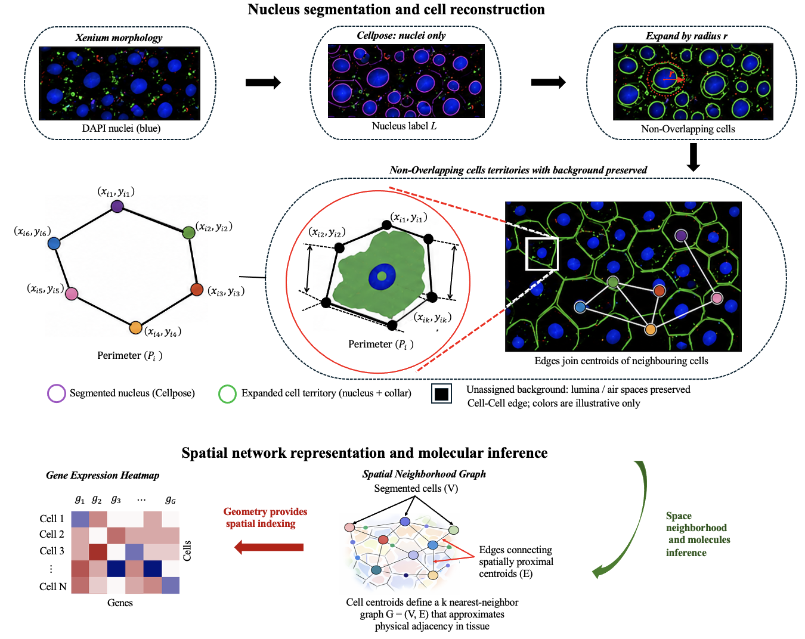

# SegMap

**SegMap** is a computational framework for **nucleus-guided cell reconstruction, spatial marker identification, and cell–cell network analysis** in imaging-based spatial transcriptomics. Starting from Xenium morphology images and transcript coordinates, SegMap reconstructs cells anchored to physically observed nuclei, assigns transcripts to reconstructed cells, builds spatial neighborhood graphs, and identifies spatially informative marker genes using a Bayesian spatial modeling framework.

Unlike transcript-density–based segmentation methods, SegMap produces **compact, non-overlapping cell territories**, preserves acellular regions (for example, vascular lumina and alveolar air spaces), and provides an integrated framework for downstream spatial analysis, clustering, and marker discovery.


---

# Overview

## SegMap Workflow

```text
Xenium Data
    │
    ▼
Nucleus Segmentation (Cellpose)
    │
    ▼
Cell Reconstruction
    │
    ▼
Transcript Assignment
    │
    ▼
Cell–Cell Spatial Network
    │
    ▼
Bayesian Spatial Marker Analysis
    │
    ▼
Spatial Clustering & Visualization
```

The complete workflow consists of five stages:

### 1. Nucleus Segmentation

Nuclei are segmented directly from Xenium DAPI morphology images using the Cellpose nuclei model.

**Input**

```text
morphology_focus/
morphology.ome.tif
```

**Output**

```text
nucleus_mask.tif
nucleus_polygons.csv
```

---

### 2. Cell Reconstruction

Each segmented nucleus is expanded by a user-defined radius to generate a reconstructed cell territory. Cell territories are mutually exclusive and preserve background regions.

**Output**

```text
reconstructed_cells.tif
cell_boundaries.csv
cell_morphology.csv
```

---

### 3. Transcript Assignment

Decoded transcripts are assigned to reconstructed cells according to their spatial coordinates.

**Output**

```text
cell_gene_matrix.h5ad
cell_gene_matrix.csv
```

---

### 4. Cell–Cell Spatial Network Construction

Cell centroids are used to construct a k-nearest-neighbor graph representing local tissue architecture.

**Output**

```text
spatial_graph.edgelist
spatial_neighbors.csv
```

---

### 5. Bayesian Spatial Marker Analysis

SegMap identifies genes exhibiting statistically significant spatial organization and cluster-specific enrichment.

For each gene, SegMap estimates:

- Posterior probability of spatial relevance
- Fraction of Spatial Variance (FSV)
- Bayes Factor
- Spatial effect size
- Cluster-specific spatial markers

**Output**

```text
spatial_markers.csv
cluster_markers.csv
marker_posteriors.csv
```

---

# Repository Structure

```text
SegMap/
│
├── README.md
├── LICENSE
├── requirements.txt
├── environment.yml
├── setup.py
├── pyproject.toml
│
├── segmap/
│   ├── run_segmap.py
│   ├── segmentation/
│   ├── reconstruction/
│   ├── transcript_assignment/
│   ├── spatial_graph/
│   ├── bayesian_marker_model/
│   ├── clustering/
│   ├── visualization/
│   └── utils/
│
├── data/
│   ├── raw/
│   ├── processed/
│   └── benchmark/
│
├── simulations/
│   ├── synthetic_generation/
│   ├── benchmark_framework/
│   └── evaluation_metrics/
│
├── benchmarking/
│   ├── segmap/
│   ├── scanpy/
│   ├── seurat/
│   ├── baysor/
│   └── comparison_results/
│
├── analysis/
│   ├── R/
│   └── Python/
│
├── figures/
│   ├── manuscript/
│   ├── supplementary/
│   └── source_data/
│
├── results/
│   ├── datasets/
│   ├── simulations/
│   └── benchmarks/
│
├── notebooks/
│
└── docs/
    ├── methods/
    ├── tutorials/
    └── examples/
```

---

# Installation

## Clone the Repository

```bash
git clone https://github.com/komlanAtitey/SegMap-.git
cd SegMap-
```

## Create a Virtual Environment

### Linux / macOS

```bash
python -m venv segmap_env
source segmap_env/bin/activate
```

### Windows

```bash
python -m venv segmap_env
segmap_env\Scripts\activate
```

## Install Dependencies

```bash
pip install -r requirements.txt
```

---

# Required Input

SegMap expects a standard Xenium output directory:

```text
XeniumData/
└── Xenium_V1_FFPE_Human_Brain_Alzheimers_With_Addon_outs/
    ├── cells.csv.gz
    ├── transcripts.csv.gz
    ├── morphology_focus/
    ├── morphology.ome.tif
    ├── experiment.xenium
    └── ...
```

---

# Running SegMap

```bash
python -m segmap.run_segmap \
  --xenium_dir XeniumData/Xenium_V1_FFPE_Human_Brain_Alzheimers_With_Addon_outs \
  --reuse_mask auto \
  --gpu \
  --no_tune_resolution \
  --resolution 0.3 \
  --n_pcs 20 \
  --expand_pixels 80 \
  --min_genes_per_cell 10 \
  --min_counts_per_cell 25 \
  --min_cells_per_gene 3 \
  --top_gene_cap 5050 \
  --cellpose_diameter 36 \
  --umap_init paga \
  --umap_min_dist 0.1
```

---

# Key Parameters

| Parameter | Description |
|------------|------------|
| `--xenium_dir` | Path to Xenium output directory |
| `--gpu` | Enable GPU acceleration |
| `--reuse_mask auto` | Reuse existing segmentation if available |
| `--resolution` | Working image resolution (µm/pixel) |
| `--cellpose_diameter` | Expected nuclear diameter for Cellpose |
| `--expand_pixels` | Cell reconstruction radius around nuclei |
| `--n_pcs` | Number of principal components |
| `--min_genes_per_cell` | Minimum genes required per cell |
| `--min_counts_per_cell` | Minimum transcript counts per cell |
| `--min_cells_per_gene` | Minimum cells expressing a gene |
| `--top_gene_cap` | Number of highly variable genes retained |
| `--umap_init` | UMAP initialization strategy |
| `--umap_min_dist` | UMAP minimum-distance parameter |

---

# Example Outputs

### Marker Scores

```text
cellpose_pipeline_outputs/data/
└── cluster_markers_all_cells_final.csv
```

### Spatial Cell Coordinates

```text
cellpose_pipeline_outputs/data/
└── spatial_clusters_final.csv
```

### Spatial Marker Visualization

```text
cellpose_pipeline_outputs/data/
└── spatial_clusters.csv
```

### UMAP Embeddings

```text
cellpose_pipeline_outputs/data/
├── umap_clusters_final.csv
└── umap_clusters.csv
```

### Seurat Object

```text
cellpose_pipeline_outputs/data/
└── seurat/
```

### Spatial Network

```text
cellpose_pipeline_outputs/data/
├── spatial_graph.edgelist
└── spatial_neighbors.csv
```

### Bayesian Marker Results

```text
cellpose_pipeline_outputs/data/
├── spatial_markers.csv
├── marker_posteriors.csv
└── cluster_markers.csv
```

---

# Benchmarking Framework

SegMap includes benchmarking workflows for comparison against leading spatial transcriptomics analysis pipelines:

- SegMap
- Scanpy
- Seurat
- Baysor

Benchmarking evaluates:

- Spatial coherence
- Moran's I
- Marker specificity
- Marker recovery
- Neighborhood purity
- Silhouette score
- Davies–Bouldin index
- Cluster stability
- Rank robustness

Results and source code are available in:

```text
benchmarking/
results/benchmarks/
```

---

# Reproducibility

All analyses presented in the manuscript are fully reproducible.

The repository contains:

- Raw and processed datasets
- Synthetic data generation pipelines
- Benchmarking workflows
- Bayesian marker model implementation
- Figure-generation scripts
- R and Python analysis code
- Manuscript source data

---

# Documentation

Detailed documentation is available in:

```text
docs/
├── tutorials/
├── methods/
└── examples/
```

including:

- Installation guide
- Input data preparation
- SegMap workflow tutorials
- Benchmarking procedures
- Reproducibility instructions
- API documentation

---

# Contact

**Dr. Komlan Atitey**  
Department of Neurosciences  
Case Western Reserve University School of Medicine  
komlan.atitey@case.edu
Cleveland, OH, USA

Please use GitHub Issues for bug reports, feature requests, and technical support.
